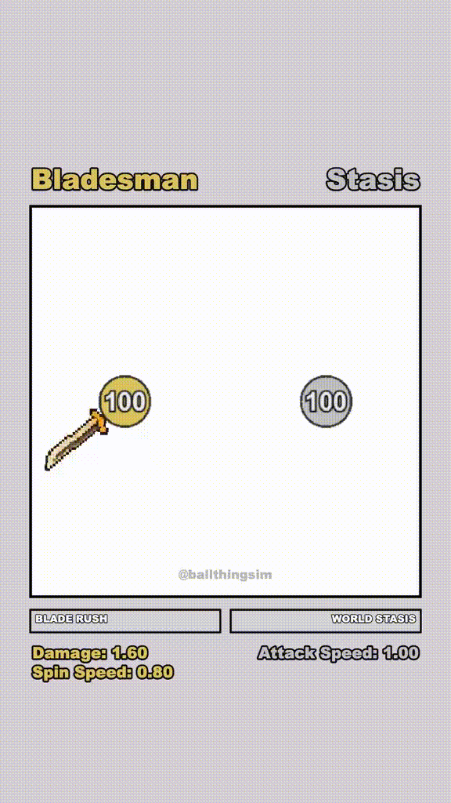
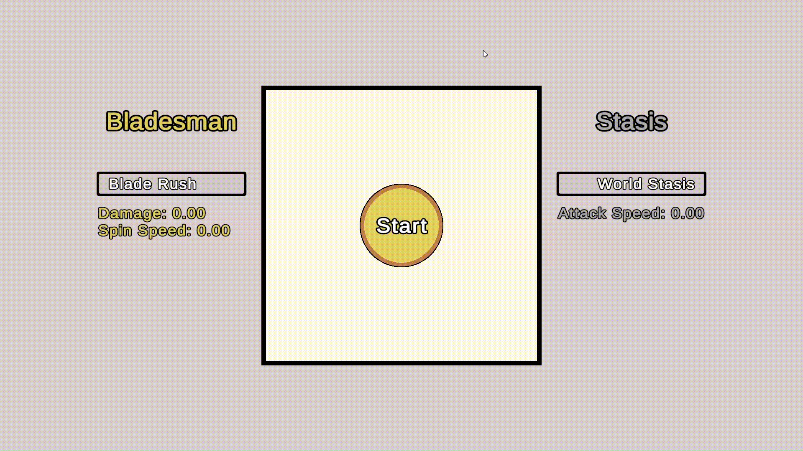
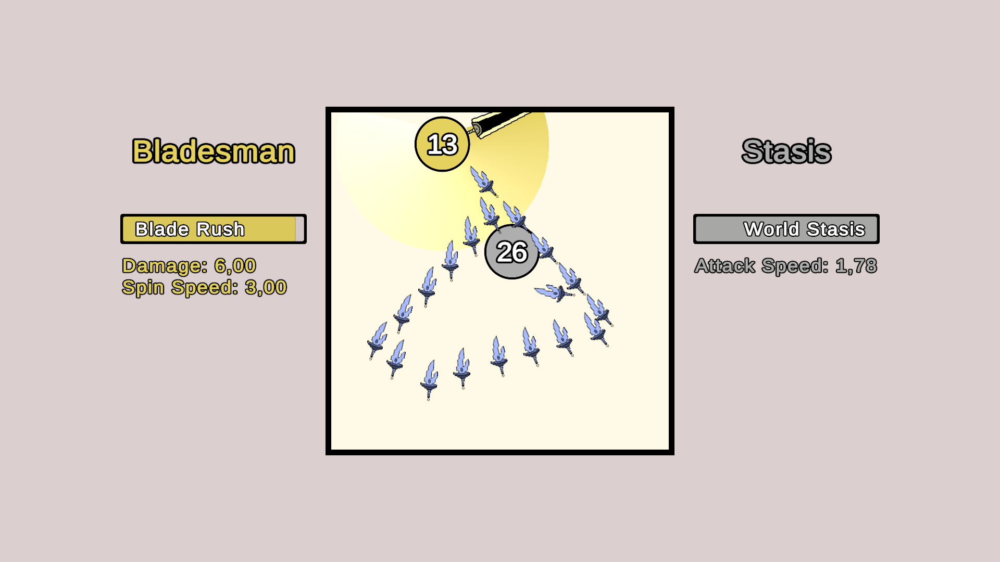
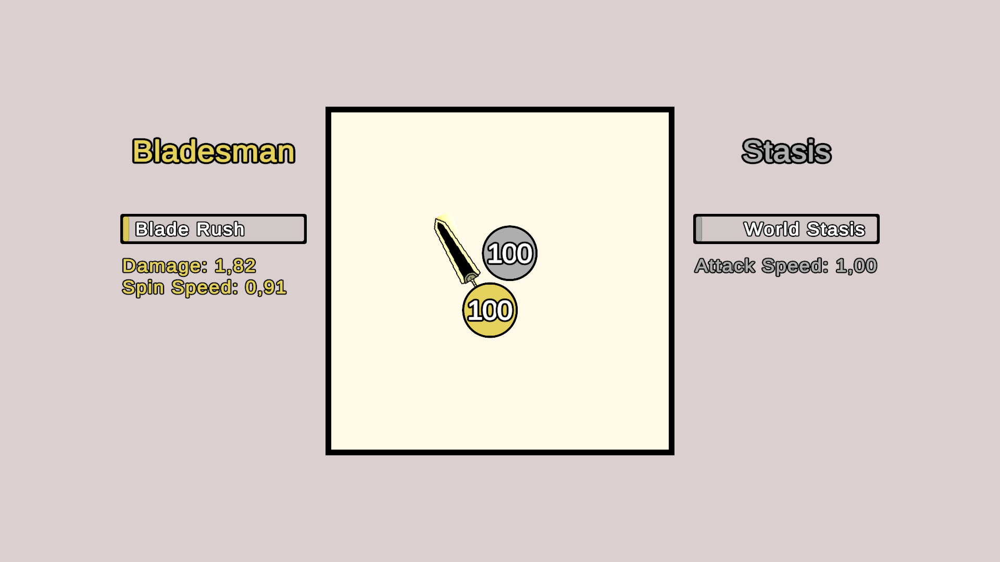
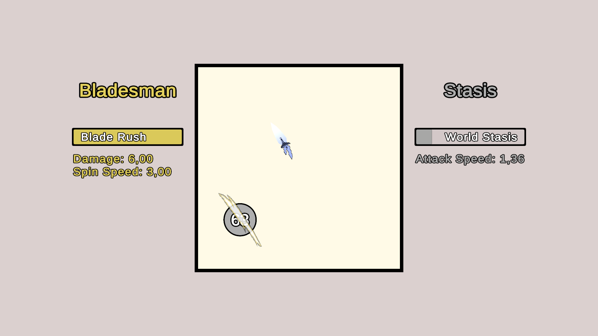
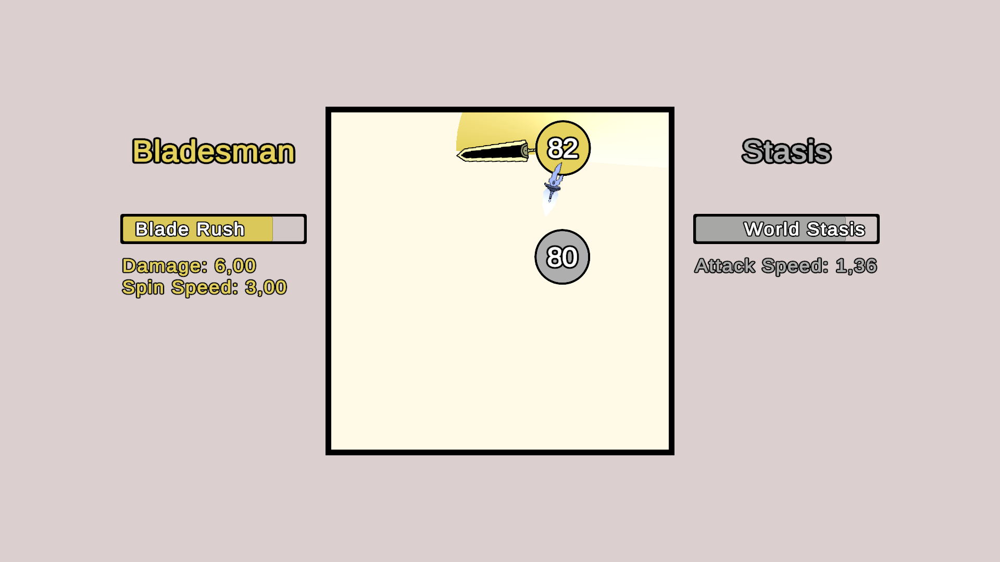

# Balls Battle

> Дуэль двух шаров с оружием, сделанная на Unity/C#

**[WebGL версия](https://yankosaretskiy.github.io/BallsBattle/)**

## референс



## геймплей




## О проекте

Pet-проект, воссоздающий механику геймплея из видео методом реверс-инжиниринга — то есть игра собиралась с нуля по наблюдению за геймплеем, без доступа к исходному коду или ассетам оригинала. Все скрипты, эффекты и баланс написаны самостоятельно.

Цель проекта — не только повторить оригинальную механику, но и заложить архитектуру, которую легко расширять: новые виды оружия, скины персонажей, и отдельная идея — превратить игру в «весёлую рулетку» для случайного выбора (choice helper) поверх той же физической основы.

## Геймплей

Два шара автоматически двигаются и отскакивают друг от друга и от стен арены, ускоряясь со временем. У каждого — своё оружие и свой стиль игры:

- **Мечник** — вращающийся вокруг себя меч, наносящий урон при контакте.
- **Кинжальщик** — периодически бросает кинжалы, которые летят к противнику.

Оба персонажа копят шкалу **ультимейта** — от времени и от нанесённых попаданий:
- Заполненная шкала мечника усиливает урон и скорость вращения меча, а по достижении максимума — на время делает мечника неуязвимым и невидимым, нанося противнику серию ударов, после чего мечник появляется рядом с ним.
- Заполненная шкала кинжальщика останавливает время для всего поля, кроме самого кинжальщика — он успевает создать залп кинжалов, которые срываются в цель одновременно сразу после снятия заморозки.

## Ключевые технические решения

- **Физика столкновений на Kinematic Rigidbody2D** вместо Dynamic — движение полностью управляется скриптами (`Transform`), а физика используется только для получения событий столкновений (`useFullKinematicContacts`).
- **Кастомный VFX-след меча** — построен через `LineRenderer` в локальном пространстве (`useWorldSpace = false`) вместо `TrailRenderer`, поскольку `TrailRenderer` в Unity принципиально работает только в мировых координатах и не умеет игнорировать перемещение родительского объекта.
- **HitStop** через временную приостановку `Time.timeScale` с отсчётом длительности через `WaitForSecondsRealtime`, не зависящий от самой паузы.
- **Раздельная, компонентная архитектура оружия** — `Ball` не знает о существовании конкретного оружия; `Sword`/`DaggerSpawner` сами находят своего владельца через `GetComponentInParent`/`GetComponent` и работают независимо друг от друга.
- **Взаимное исключение и синхронизация ультимейтов** двух персонажей через общий статический класс состояния, без привязки к конкретным экземплярам сцены.

## Технологии

- Unity 6000.3.10f1
- C#
- TextMeshPro, uGUI
- WebGL

## Запуск локально

```
git clone https://github.com/YanKosaretskiy/BallsBattle.git
```

Открыть папку проекта через Unity Hub (версия Unity указана выше).

## Планы по развитию

- Новые виды оружия с уникальными механиками ультимейтов
- Скины персонажей
- Отдельный игровой режим — использование той же физической механики как альтернативы обычной рулетке для случайного выбора

## Скриншоты




